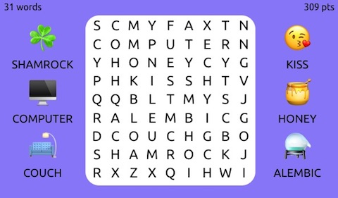

# WordSeek
A word search game implemented using modern web technologies, especially CSS flex box and SVG.

## Usage

    Open wordseek.html in your favorite browser

## History

The first implementation tried using only DIV elements to implement the grid.
But making it scale on different devices (e.g. iPhone, laptop, iPad) proved hard:
using font-size:1vw for example was a guessing game.

The second implementation used a CANVAS element: scaling it also scaled the characters
drawn in the grid. But the font drawn on the CANVAS looked not as sharp as the words nearby.
Even after taking into account the device pixel ratio to boost the size of the CANVAS 
on retina displays.

The current implementation draws the grid using an SVG element.
Underneath each text, a small rectangle captures the mouse or touch events.
Text elements are removed from the event loop using the CSS  rule pointer-events:none.
Without the rectangles behind each character, the event would not fire unless the mouse
or finger was touching the glyph.

A neat CSS animation shows the number of words found in the current round.
Again, the CSS pointer-events:none is used to prevent stealing events destined to the grid
element underneath.

The CSS is responsive using media queries to detect device orientation and width.
